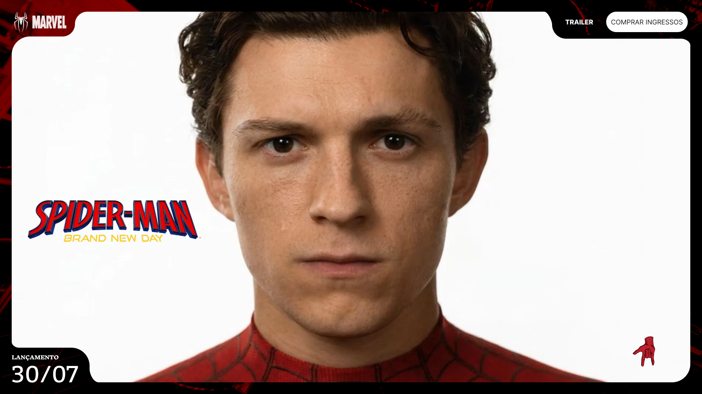

  

## 🕷️🕸️ Spider-Man — Brand New Day

 https://kauanykatsan.github.io/spider-man-um-novo-dia/

A web development project inspired by **Spider-Man — Brand New Day**.

## Course

This project was developed as part of the **DevArt — Um Novo Dia** course by **WebHub**, taught by **Gustavo Campelo**.

The goal of the course was to learn how to develop a complete web project using Artificial Intelligence as a support tool throughout the development process.
## My Version

This is my personalized version of the project presented in the course.

I followed the original project structure and concepts while making my own changes, including:

- Different images
- Different characters and character names
- Customized visual elements
- My own content and adjustments

## Technologies

- HTML
- CSS
- JavaScript
- GSAP

## About the Project

The goal of this project was to practice web development by following a real-world website creation process and learning how to combine **HTML, CSS, JavaScript, GSAP, and Figma**.

## Status

Completed

## Author

**Kauany dos Santos**

---

**Original course:** DevArt — Um Novo Dia  
**Instructor:** Gustavo Campelo  
**WebHub**
